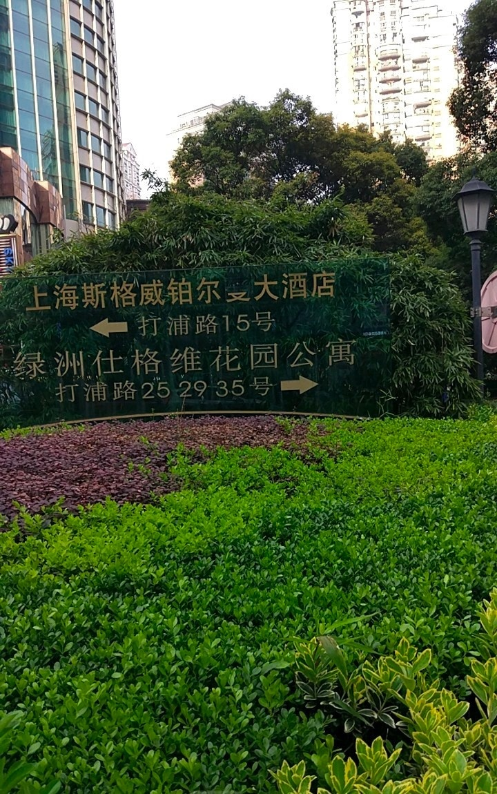

# PaddleOCR-Torch-Infer


PaddleOCR是效果最好的开源OCR工具之一，然而，其原生只支持在paddlepaddle框架中运行。

常见项目中，往往使用更普遍的Pytorch框架，单独安装paddlepaddle不仅会让项目过于臃肿，而且可能存在冲突问题。

因此，本项目将MinerU中文本检测识别的*推理*部分单独提取出来，方便在其它项目中集成。

## 所用模型

检测模型：ptocr_v5_mobile_det.pth

识别模型：ptocr_v5_mobile_rec.pth

字典文件：ppocrv5_dict.txt

如果需要其它模型，可从 PaddleOCR2Pytorch 仓库中获取：

传送门：https://pan.baidu.com/s/1r1DELT8BlgxeOP2RqREJEg (提取码：6clx)

## 项目结构

```
TorchocrInfer/
├── infer.py              # 主程序入口
├── utils/                # 工具函数目录
│   └── visualize.py      # 可视化相关函数
└── test_img/             # 测试图片目录
```

## 使用方法

### 安装依赖

1. 安装uv包管理器

建议使用uv来管理依赖环境，若未安装uv，可通过pip进行安装：
```bash
pip install uv
```

2. 创建虚拟环境
```bash
uv venv --python 3.10
```

3. 激活虚拟环境
```bash
.venv/Scripts/activate
```

4. 根据`uv.lock`安装依赖
```bash
uv sync
```

### 命令行参数

- `--data_path`：**必需参数**，指定输入图片路径或目录路径
- `--save_path`：**可选参数**，指定保存结果的路径或目录
- `--show_confidence`：**可选参数**，是否在结果图像中显示置信度（默认不显示）

### 单图片处理

```bash
python infer.py --data_path test_img/general_ocr_rec_001.png --save_path output/result.png
```

### 目录批量处理

```bash
python infer.py --data_path test_img --save_path output
```

## 推理视频

```bash
python infer_video.py --video_path test_video/ocr_test.mp4
```

## 识别效果展示

<div align="center">
  
  
  
  <video src="https://github.com/zstar1003/PaddleOCR-Torch-Infer/blob/main/output/ocr_test_ocr_result.mp4" controls width="100%"></video>
</div>


## 参考

- [PaddleOCR](https://github.com/PaddlePaddle/PaddleOCR)

- [PaddleOCR2Pytorch](https://github.com/frotms/PaddleOCR2Pytorch)

- [MinerU](https://github.com/opendatalab/MinerU)
